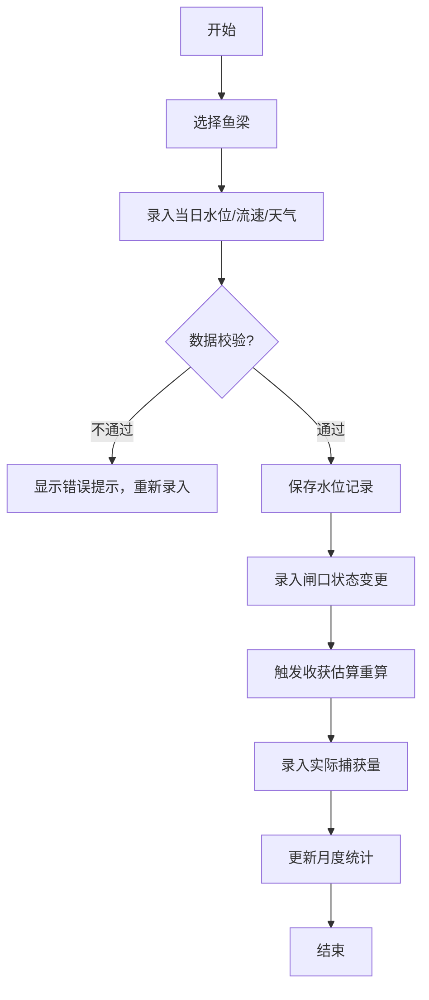
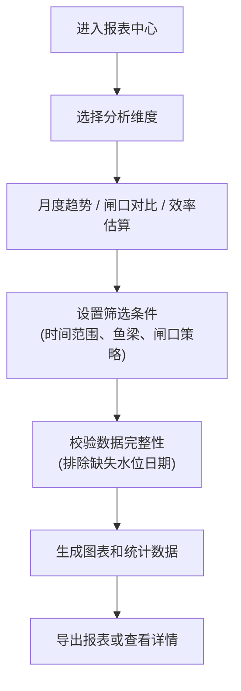

## 1. 产品概述

传统鱼梁捕鱼效率研究系统，用于民俗学和水利学研究团队记录、分析和复原历史上鱼梁的捕鱼作业方式。系统支持鱼梁档案管理、每日水文数据录入、闸口状态追踪、鱼群经过记录和智能收获估算，帮助研究者量化不同季节、水位和闸口策略下的捕鱼效率。

- 目标用户：民俗学研究者、水利史研究者、文化遗产保护团队
- 核心价值：数字化保存传统渔业知识，量化分析历史作业效率，为文化复原提供数据支撑

## 2. 核心功能

### 2.1 用户角色

| 角色 | 注册方式 | 核心权限 |
|------|----------|----------|
| 研究员 | 管理员创建账号 | 数据录入、查询分析、报表导出 |
| 管理员 | 系统初始化 | 用户管理、数据审核、系统配置 |

### 2.2 功能模块

1. **仪表盘**：数据概览、快捷操作入口、核心指标展示
2. **鱼梁档案管理**：鱼梁基本信息的增删改查
3. **水位记录管理**：每日水位、流速、天气数据录入
4. **闸口状态管理**：闸口开合状态记录与变更追踪
5. **鱼群记录管理**：鱼群经过观测记录
6. **收获记录管理**：实际捕获量录入
7. **数据报表中心**：月度收获趋势、闸口策略对比、效率估算

### 2.3 页面详情

| 页面名称 | 模块名称 | 功能描述 |
|----------|----------|----------|
| 仪表盘 | 数据概览 | 鱼梁总数、今日记录数、本月收获总量、效率趋势图 |
| 仪表盘 | 快捷操作 | 快速录入水位、快速录入收获、查看报表 |
| 鱼梁列表页 | 鱼梁档案 | 鱼梁列表展示、搜索筛选、新增/编辑/删除 |
| 鱼梁详情页 | 基本信息 | 鱼梁编号、位置、建造年代、闸口数量、结构描述 |
| 鱼梁详情页 | 关联数据 | 该鱼梁的水位记录、闸口状态、收获记录时间线 |
| 水位记录页 | 数据录入 | 日期、水位、流速、天气、备注录入 |
| 水位记录页 | 列表展示 | 按鱼梁、日期范围筛选，数据校验提示 |
| 闸口状态页 | 状态管理 | 闸口编号、开合状态、变更时间、操作人记录 |
| 收获记录页 | 捕获录入 | 日期、鱼种、重量、数量、录入人 |
| 报表中心 | 月度趋势 | 按月份展示收获量趋势折线图 |
| 报表中心 | 闸口策略对比 | 不同闸口开合模式下的效率对比柱状图 |
| 报表中心 | 效率估算 | 基于水位、闸口状态、历史数据的收获估算表 |

## 3. 核心业务流程

### 3.1 日常数据录入流程

### 3.2 数据分析流程

## 4. 核心业务规则

1. **鱼梁编号唯一性**：鱼梁编号不能重复，创建和编辑时自动校验
2. **数值非负约束**：水位、流速、捕获量均不能为负数
3. **每日唯一水位记录**：同一鱼梁同一天只能有一条主水位记录
4. **捕获量非负约束**：实际捕获量不能小于 0
5. **数据完整性约束**：缺失水位记录的日期不参与效率估算
6. **闸口状态联动**：闸口状态变化后，相关时间段的收获估算需要重新计算

## 5. 用户界面设计

### 5.1 设计风格

- **主色调**：靛蓝色 (#1e3a5f) - 代表水与传统智慧
- **辅助色**：土黄色 (#c9a227) - 代表大地与渔业丰收
- **中性色**：象牙白 (#f5f0e1)、深灰 (#2d3436)
- **设计风格**：新中式传统风格，融入水波纹、鱼纹等传统元素
- **按钮风格**：圆角矩形，悬停时有轻微上浮效果
- **字体**：标题使用"Noto Serif SC"宋体类字体，正文使用"Noto Sans SC"无衬线字体
- **布局**：左侧导航 + 顶部操作栏 + 主内容区的经典后台布局
- **图标风格**：线性图标，融入传统纹样元素

### 5.2 页面设计概述

| 页面名称 | 模块名称 | UI 元素 |
|----------|----------|----------|
| 仪表盘 | 数据概览 | 卡片式指标展示、渐变色背景、图表区带水波纹底纹 |
| 鱼梁列表页 | 表格区域 | 斑马纹表格、悬停高亮、操作按钮组 |
| 数据录入页 | 表单区域 | 传统卷轴风格表单、标签居左、输入框带边框装饰 |
| 报表中心 | 图表区域 | Chart.js 折线图/柱状图、图例可交互、数据表格联动 |
| 鱼梁详情页 | 时间线 | 垂直时间线展示历史记录，不同类型数据用不同颜色标记 |

### 5.3 响应式设计

- **桌面优先**：以 1440px 宽度为基准设计
- **平板适配**：左侧导航可折叠，表格支持横向滚动
- **移动端**：导航转为底部标签栏，表单单列布局，图表支持触摸缩放

## 6. 技术实现要点

1. **数据校验**：模型层 + 表单层双重校验，确保业务规则不被突破
2. **估算重算**：闸口状态变更时使用信号触发异步重算
3. **图表渲染**：使用 Chart.js 实现交互式数据可视化
4. **数据导出**：支持 CSV 格式导出报表数据
5. **操作日志**：关键数据操作留痕，支持审计追踪
