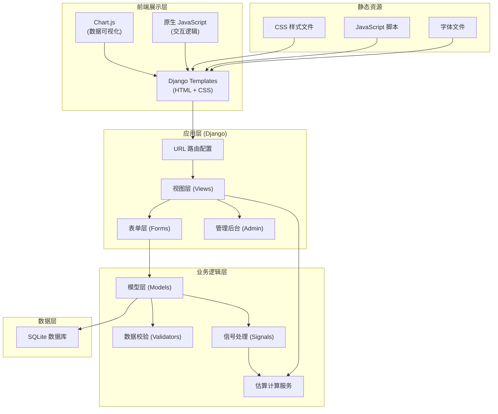
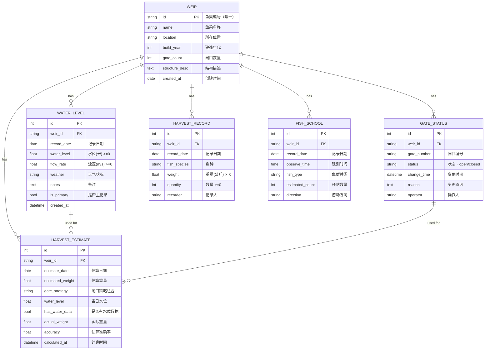
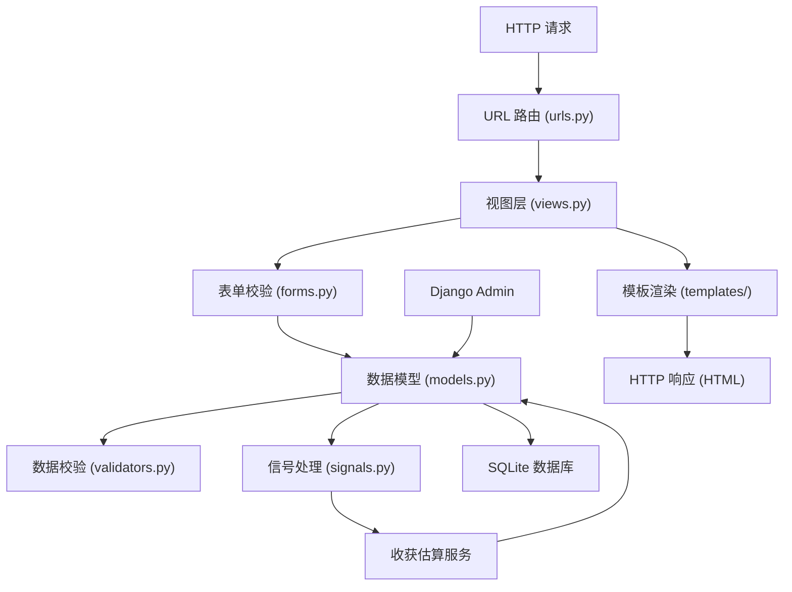

## 1. 架构设计



## 2. 技术栈说明

| 层级 | 技术选型 | 版本说明 | 用途 |
|------|----------|----------|------|
| 开发语言 | Python | 3.9+ | 后端开发语言 |
| Web 框架 | Django | 4.2 LTS | MVC 框架，提供 ORM、模板、路由等 |
| 数据库 | SQLite | 3.x | 轻量级关系型数据库，无需额外部署 |
| 模板引擎 | Django Templates | 内置 | 服务端页面渲染 |
| 图表库 | Chart.js | 4.x | 前端数据可视化，折线图、柱状图 |
| 前端样式 | 自定义 CSS | - | 新中式风格样式，不依赖第三方 UI 库 |
| 前端交互 | 原生 JavaScript | ES6+ | 表单验证、动态交互 |

## 3. 项目目录结构

```
yuliang-system/
├── manage.py                    # Django 管理脚本
├── requirements.txt             # Python 依赖清单
├── yuliang_system/              # 项目主配置目录
│   ├── __init__.py
│   ├── settings.py              # 项目配置
│   ├── urls.py                  # 根 URL 配置
│   └── wsgi.py                  # WSGI 入口
├── weir/                        # 鱼梁管理应用
│   ├── __init__.py
│   ├── admin.py                 # 管理后台配置
│   ├── apps.py
│   ├── forms.py                 # 表单定义
│   ├── migrations/              # 数据库迁移文件
│   ├── models.py                # 数据模型定义
│   ├── signals.py               # 信号处理（闸口变更触发重算）
│   ├── urls.py                  # 应用 URL 配置
│   ├── validators.py            # 自定义数据校验器
│   ├── views.py                 # 视图函数
│   └── services/
│       ├── __init__.py
│       └── harvest_estimator.py # 收获估算服务
└── templates/                   # Django 模板目录
    ├── base.html                # 基础模板
    ├── dashboard/
    │   └── index.html           # 仪表盘
    ├── weir/
    │   ├── list.html            # 鱼梁列表
    │   ├── detail.html          # 鱼梁详情
    │   └── form.html            # 鱼梁表单
    ├── water_level/
    │   ├── list.html            # 水位记录列表
    │   └── form.html            # 水位记录表单
    ├── gate/
    │   ├── list.html            # 闸口状态列表
    │   └── form.html            # 闸口状态表单
    ├── harvest/
    │   ├── list.html            # 收获记录列表
    │   └── form.html            # 收获记录表单
    ├── fish_school/
    │   ├── list.html            # 鱼群记录列表
    │   └── form.html            # 鱼群记录表单
    └── reports/
        ├── monthly_trend.html   # 月度趋势报表
        ├── gate_comparison.html # 闸口策略对比
        └── efficiency_estimate.html # 效率估算报表
└── static/                      # 静态资源目录
    ├── css/
    │   ├── main.css             # 主样式文件
    │   └── forms.css            # 表单样式
    ├── js/
    │   ├── chart.config.js      # Chart.js 配置
    │   └── form.validation.js   # 前端表单验证
    └── fonts/                   # 自定义字体文件
```

## 4. 路由定义

| 路由路径 | 视图函数 | 页面用途 |
|----------|----------|----------|
| `/` | `dashboard_index` | 系统仪表盘首页 |
| `/weirs/` | `weir_list` | 鱼梁档案列表 |
| `/weirs/create/` | `weir_create` | 新增鱼梁档案 |
| `/weirs/<int:pk>/` | `weir_detail` | 鱼梁详情页 |
| `/weirs/<int:pk>/edit/` | `weir_edit` | 编辑鱼梁档案 |
| `/weirs/<int:pk>/delete/` | `weir_delete` | 删除鱼梁档案 |
| `/water-levels/` | `water_level_list` | 水位记录列表 |
| `/water-levels/create/` | `water_level_create` | 新增水位记录 |
| `/water-levels/<int:pk>/edit/` | `water_level_edit` | 编辑水位记录 |
| `/gates/` | `gate_status_list` | 闸口状态列表 |
| `/gates/create/` | `gate_status_create` | 新增闸口状态 |
| `/harvests/` | `harvest_list` | 收获记录列表 |
| `/harvests/create/` | `harvest_create` | 新增收获记录 |
| `/fish-schools/` | `fish_school_list` | 鱼群记录列表 |
| `/fish-schools/create/` | `fish_school_create` | 新增鱼群记录 |
| `/reports/monthly-trend/` | `report_monthly_trend` | 月度收获趋势报表 |
| `/reports/gate-comparison/` | `report_gate_comparison` | 闸口策略对比报表 |
| `/reports/efficiency/` | `report_efficiency` | 效率估算报表 |
| `/admin/` | Django Admin | 系统管理后台 |

## 5. 数据模型设计

### 5.1 ER 图



### 5.2 数据约束说明

| 约束名称 | 应用位置 | 约束规则 |
|----------|----------|----------|
| 鱼梁编号唯一 | `Weir.code` | `unique=True` 数据库级约束 |
| 水位非负 | `WaterLevel.water_level` | `MinValueValidator(0)` |
| 流速非负 | `WaterLevel.flow_rate` | `MinValueValidator(0)` |
| 捕获重量非负 | `HarvestRecord.weight` | `MinValueValidator(0)` |
| 捕获数量非负 | `HarvestRecord.quantity` | `MinValueValidator(0)` |
| 鱼梁+日期唯一主记录 | `WaterLevel` | `unique_together = ['weir', 'record_date', 'is_primary']` 且 `is_primary=True` 时唯一 |
| 每日唯一水位记录 | `WaterLevel` | 自定义 `clean()` 方法校验 |

## 6. 核心业务逻辑实现

### 6.1 收获估算算法

```python
# 估算逻辑概述：
# 1. 获取当日水位记录（必须存在，否则不参与估算）
# 2. 获取当日生效的闸口状态组合
# 3. 基于历史数据（相同水位区间+相同闸口策略）计算平均捕获量
# 4. 考虑季节系数（汛期/枯水期）
# 5. 计算最终估算值 = 历史平均值 × 季节系数 × 水位修正系数

def estimate_harvest(weir, estimate_date):
    # 1. 检查水位数据
    water_level = WaterLevel.objects.filter(
        weir=weir,
        record_date=estimate_date,
        is_primary=True
    ).first()
    
    if not water_level:
        return None  # 缺失水位数据，不参与估算
    
    # 2. 获取当日闸口策略
    gate_strategy = get_active_gate_strategy(weir, estimate_date)
    
    # 3. 查询相似条件的历史数据
    similar_records = HarvestRecord.objects.filter(
        weir=weir,
        record_date__month=estimate_date.month,
        water_level__range=[water_level - 0.5, water_level + 0.5]
    ).annotate(
        strategy=get_gate_strategy_for_date(weir, F('record_date'))
    ).filter(strategy=gate_strategy)
    
    # 4. 计算估算值
    if similar_records.exists():
        avg_weight = similar_records.aggregate(
            Avg('weight')
        )['weight__avg']
        season_factor = get_season_factor(estimate_date)
        estimated = avg_weight * season_factor
    else:
        estimated = get_baseline_estimate(weir, water_level, gate_strategy)
    
    return estimated
```

### 6.2 闸口状态变更触发重算

```python
# Django Signal 实现
from django.db.models.signals import post_save, post_delete
from django.dispatch import receiver

@receiver(post_save, sender=GateStatus)
def trigger_estimate_recalculation(sender, instance, **kwargs):
    """
    闸口状态变更后，重新计算相关日期的收获估算
    重算范围：从变更时间起至当前所有日期
    """
    weir = instance.weir
    start_date = instance.change_time.date()
    end_date = timezone.now().date()
    
    # 批量重新计算
    recalculate_estimates(weir, start_date, end_date)

@receiver(post_delete, sender=GateStatus)
def trigger_estimate_recalculation_on_delete(sender, instance, **kwargs):
    trigger_estimate_recalculation(sender, instance, **kwargs)
```

## 7. 服务端架构



## 8. API 与数据格式

本项目采用服务端渲染架构，主要通过表单提交数据。以下是核心数据结构：

### 8.1 鱼梁数据结构

```python
# Weir 模型核心字段
{
    'code': 'YL-001',           # 鱼梁编号，唯一
    'name': '杨家坝鱼梁',        # 鱼梁名称
    'location': '沅陵县五强溪镇', # 位置
    'build_year': 1876,          # 建造年代
    'gate_count': 5,             # 闸口数量
    'structure_desc': '...',     # 结构描述
}
```

### 8.2 水位记录数据结构

```python
# WaterLevel 模型核心字段
{
    'weir': 'YL-001',
    'record_date': '2024-03-15',
    'water_level': 2.85,        # 米，>= 0
    'flow_rate': 1.2,           # m/s，>= 0
    'weather': '晴',
    'is_primary': True,         # 当日主记录，每鱼梁每天唯一
}
```

### 8.3 闸口状态数据结构

```python
# GateStatus 模型核心字段
{
    'weir': 'YL-001',
    'gate_number': 'G-1',
    'status': 'open',           # open / closed
    'change_time': '2024-03-15 08:30:00',
    'operator': '研究员A',
}
```

### 8.4 收获记录数据结构

```python
# HarvestRecord 模型核心字段
{
    'weir': 'YL-001',
    'record_date': '2024-03-15',
    'fish_species': '鲤鱼',
    'weight': 15.5,             # 公斤，>= 0
    'quantity': 8,              # >= 0
    'recorder': '研究员A',
}
```

## 9. 数据库索引设计

| 表名 | 索引字段 | 索引类型 | 用途 |
|------|----------|----------|------|
| `weir` | `code` | UNIQUE | 鱼梁编号唯一约束 |
| `water_level` | `weir_id, record_date, is_primary` | UNIQUE | 每日唯一主水位记录 |
| `water_level` | `weir_id, record_date` | INDEX | 按鱼梁和日期查询 |
| `gate_status` | `weir_id, change_time` | INDEX | 闸口状态时序查询 |
| `harvest_record` | `weir_id, record_date` | INDEX | 收获记录查询 |
| `harvest_estimate` | `weir_id, estimate_date` | UNIQUE | 估算结果唯一约束 |
| `harvest_estimate` | `weir_id, estimate_date` | INDEX | 报表查询优化 |
